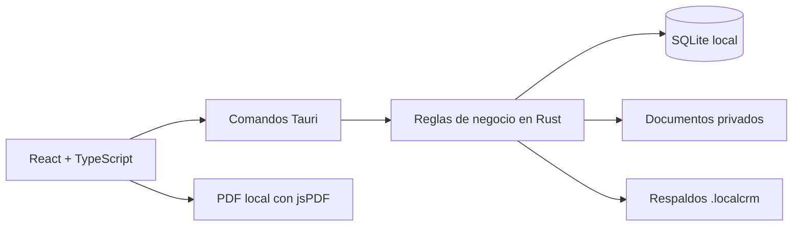

# Local CRM

[English](README.md) | [Español](README.es.md)

[](https://github.com/sbranma/local-crm/actions/workflows/ci.yml)

Local CRM es una aplicación de escritorio en español para pequeños negocios de servicios y profesionales independientes que necesitan administrar su operación sin depender de un servidor externo. Funciona sin conexión para sus funciones principales y conserva la información del negocio en la computadora del usuario.

El producto fue diseñado pensando en negocios locales hispanohablantes, incluidos pequeños negocios de Costa Rica. Su interfaz, recorrido inicial y documentos generados están disponibles actualmente en español.

**Estado:** versión 0.1.0 pública para Windows x64.

[Descargar Local CRM v0.1.0 para Windows](https://github.com/sbranma/local-crm/releases/tag/v0.1.0)


*Recorrido real de la aplicación con información ficticia generada por su modo de demostración.*

## El problema del negocio

Muchos negocios pequeños necesitan organizar clientes, compromisos, cotizaciones, inventario y documentos, pero no requieren una plataforma empresarial ni una suscripción mensual. Local CRM reúne ese flujo en una aplicación local, comprensible, práctica y fácil de respaldar.

El producto está orientado a técnicos, contratistas, freelancers, consultores, pequeñas agencias y proveedores de servicios que trabajan solos o con un equipo reducido.

## Qué demuestra este proyecto

- Traducción de necesidades del negocio en un alcance de producto completo.
- Diseño de flujos conectados entre clientes, tareas, agenda, cotizaciones, inventario y documentos.
- Separación entre interfaz, reglas de negocio y persistencia.
- Manejo de datos locales, migraciones, validaciones, respaldos y recuperación.
- Entrega de un instalador para Windows, una versión pública, documentación técnica y controles automatizados de calidad.
- Comunicación explícita del alcance, la privacidad, la seguridad y las limitaciones del producto.

## Funciones principales

- Dashboard operativo con trabajo próximo, prioridades, estado de cotizaciones y clientes recientes.
- CRUD de clientes con búsqueda, archivo, restauración y eliminación permanente confirmada.
- Tareas con prioridad, estado, fecha programada y relación opcional con clientes.
- Agenda mensual, semanal y diaria que combina eventos y tareas programadas sin duplicar registros.
- Cotizaciones con conceptos, impuestos, descuentos, estados, historial y generación de PDF sin conexión.
- Catálogo compartido de productos y servicios con movimientos auditables y control de stock bajo.
- Gestión privada de documentos mediante carpetas y relaciones opcionales con clientes.
- Configuración del negocio, moneda, condiciones y logotipo para documentos generados.
- Respaldos completos `.localcrm` con validación, vista previa y restauración segura.
- Recorrido de primer uso y datos ficticios opcionales para explorar el flujo completo.

## Tecnologías

- React y TypeScript para la interfaz basada en componentes y los contratos explícitos.
- Vite para el desarrollo y la construcción de producción del frontend.
- Tauri y Rust para la aplicación de escritorio, operaciones nativas, validaciones y reglas de negocio.
- SQLite para persistencia local estructurada y migraciones versionadas.
- GitHub Actions para lint, tipos, compilación, pruebas Rust, formato y Clippy.

## Arquitectura



La interfaz no consulta SQLite directamente. React presenta la información y valida la interacción; los comandos de Tauri exponen operaciones enfocadas; Rust aplica reglas de negocio, valida entradas y accede a SQLite mediante consultas parametrizadas.

## Decisiones técnicas destacadas

- Los importes monetarios se guardan como enteros para evitar errores de coma flotante.
- Las cantidades de inventario admiten milésimas sin guardar números decimales en SQLite.
- Las cotizaciones emitidas conservan una copia de los datos del cliente, descripciones, unidades y precios utilizados.
- Tareas y eventos permanecen como fuentes separadas y se combinan únicamente para su presentación.
- Las salidas de inventario no pueden producir existencias negativas.
- Los documentos usan nombres internos generados y validación de tipo, tamaño, firma y ruta.
- Las migraciones versionadas conservan compatibilidad con bases locales existentes cuando es razonable.
- Los datos ficticios solo pueden cargarse en una base completamente vacía y dentro de una transacción.

## Datos locales y privacidad

La aplicación instalada y los datos del negocio se guardan por separado:

```text
Aplicación:  %LOCALAPPDATA%\Local CRM
Base SQLite: %APPDATA%\com.localcrm.desktop\local-crm.sqlite3
Documentos:  %APPDATA%\com.localcrm.desktop\documents
```

Los PDF, las copias exportadas y los respaldos se guardan donde el usuario elija mediante diálogos nativos de Windows. Antes de restaurar un respaldo, Local CRM crea automáticamente `local-crm-before-last-restore.localcrm` junto a la base activa.

La información local y los respaldos **no están cifrados**. La aplicación está diseñada para un usuario en una computadora Windows y no incluye actualmente autenticación, sincronización en la nube ni permisos multiusuario.

## Probar la aplicación

El instalador NSIS en español está disponible en [GitHub Releases](https://github.com/sbranma/local-crm/releases/tag/v0.1.0). Se instala para el usuario actual de Windows sin requerir permisos de administrador para la carpeta de la aplicación.

En una instalación nueva se puede:

1. Recorrer la guía inicial de cuatro pasos en español.
2. Empezar con una base vacía o cargar datos ficticios claramente identificados.
3. Explorar el flujo Cliente -> Tarea o Agenda -> Cotización -> PDF.
4. Crear un respaldo completo desde **Configuración -> Respaldos**.

Windows puede mostrar una advertencia de SmartScreen porque este instalador de portafolio no está firmado digitalmente.

## Desarrollo local

### Requisitos

- Node.js LTS y npm.
- Rust estable con toolchain MSVC.
- Microsoft C++ Build Tools para escritorio.
- Microsoft Edge WebView2.

### Comandos

```powershell
npm.cmd install
npm.cmd run tauri dev
```

Comprobaciones de calidad:

```powershell
npm.cmd run lint
npm.cmd run typecheck
npm.cmd run build
cargo fmt --manifest-path src-tauri/Cargo.toml --check
cargo test --manifest-path src-tauri/Cargo.toml
cargo clippy --manifest-path src-tauri/Cargo.toml --all-targets -- -D warnings
```

GitHub Actions ejecuta estas comprobaciones en cada pull request y actualización de `main`.

## Desarrollo asistido por IA

Durante el desarrollo se utilizaron herramientas de inteligencia artificial como apoyo para explorar alternativas, acelerar iteraciones y revisar implementación y documentación. El alcance, las decisiones de producto y arquitectura, la validación de resultados, las pruebas y el control de versiones permanecieron bajo criterio y supervisión del autor.

## Alcance y limitaciones

Local CRM no pretende sustituir un ERP, un sistema de facturación fiscal ni una plataforma colaborativa. Reportes avanzados, correo, WhatsApp, facturación fiscal, autenticación, cifrado, integraciones con APIs externas y sincronización permanecen fuera de esta versión.

Las decisiones de producto, arquitectura, seguridad y alcance están documentadas en [`PROJECT_CONTEXT.md`](PROJECT_CONTEXT.md).

## Autor y licencia

Proyecto de portafolio de **[Brian Moncaleano](https://www.linkedin.com/in/brian-moncaleano-8b7b89243/)** ([sbranma en GitHub](https://github.com/sbranma)), publicado bajo la [licencia MIT](LICENSE).

Código fuente oficial: [github.com/sbranma/local-crm](https://github.com/sbranma/local-crm)
