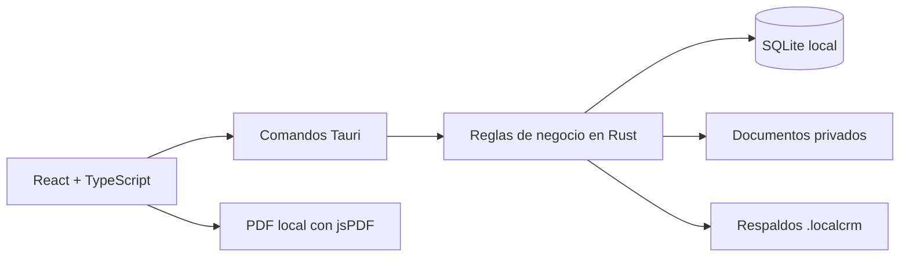

# Local CRM

[](https://github.com/sbranma/local-crm/actions/workflows/ci.yml)

CRM de escritorio para pequeños negocios y profesionales independientes que necesitan administrar su operación sin depender de un servidor externo. Funciona en Windows, conserva la información localmente y puede usarse sin conexión a Internet en sus funciones principales.

**Estado:** versión 0.1.0 pública para Windows x64.

[Descargar Local CRM v0.1.0 para Windows](https://github.com/sbranma/local-crm/releases/tag/v0.1.0)

## Qué problema resuelve

Muchos negocios pequeños necesitan organizar clientes, compromisos, cotizaciones, inventario y documentos, pero no requieren una plataforma empresarial ni una suscripción mensual. Local CRM reúne ese flujo en una aplicación local, comprensible y fácil de respaldar.

El producto está orientado a técnicos, contratistas, freelancers, consultores, pequeñas agencias y proveedores de servicios que trabajan solos o con un equipo reducido.

## Funciones principales

- Dashboard con trabajo próximo, prioridades, estado comercial y clientes recientes.
- CRUD de clientes con búsqueda, archivo, restauración y eliminación confirmada.
- Tareas con prioridad, estado, fecha programada y relación opcional con clientes.
- Agenda mensual, semanal y diaria que combina eventos y tareas sin duplicarlas.
- Cotizaciones con conceptos, impuestos, descuentos, estados, historial y PDF sin conexión.
- Catálogo de productos y servicios con movimientos auditables y control de stock.
- Archivos privados organizados en carpetas y relacionados opcionalmente con clientes.
- Configuración del negocio, moneda, condiciones y logotipo para documentos.
- Respaldos completos `.localcrm` con validación, vista previa y restauración segura.
- Recorrido de primer uso y datos ficticios opcionales para demostrar el flujo completo.

## Arquitectura



La interfaz no consulta SQLite directamente. React presenta la información y valida la interacción; los comandos de Tauri exponen operaciones concretas; Rust aplica reglas, valida entradas y accede a SQLite mediante consultas parametrizadas.

## Decisiones técnicas destacadas

- Los importes monetarios se guardan como enteros para evitar errores de coma flotante.
- Las cantidades de inventario admiten milésimas sin usar números decimales en SQLite.
- Las cotizaciones conservan una copia de los datos y precios utilizados como historial.
- Tareas y eventos son fuentes separadas que Agenda combina solamente al presentarlas.
- Las salidas de inventario no pueden producir existencias negativas.
- Los documentos usan nombres internos generados y validación de tipo, tamaño y ruta.
- Las migraciones mantienen compatibilidad con bases locales de versiones anteriores.
- Los datos ficticios solo pueden cargarse en una base completamente vacía y dentro de una transacción.

## Datos locales y privacidad

La instalación y los datos están separados:

```text
Aplicación:  %LOCALAPPDATA%\Local CRM
Base SQLite: %APPDATA%\com.localcrm.desktop\local-crm.sqlite3
Documentos:  %APPDATA%\com.localcrm.desktop\documents
```

Los PDF, las copias exportadas y los respaldos se guardan donde el usuario elija mediante diálogos nativos de Windows. Antes de una restauración, Local CRM crea automáticamente `local-crm-before-last-restore.localcrm` junto a la base activa.

La información local y los respaldos **no están cifrados**. La aplicación está diseñada para un solo usuario en una computadora Windows y no incluye autenticación, sincronización en la nube ni permisos multiusuario.

## Probar la aplicación

El instalador NSIS está disponible en [GitHub Releases](https://github.com/sbranma/local-crm/releases/tag/v0.1.0). La instalación se realiza para el usuario actual, en español y sin requerir permisos de administrador para la carpeta del programa.

En una instalación nueva se puede:

1. Recorrer la guía inicial de cuatro pasos.
2. Empezar con una base vacía o cargar datos ficticios identificados como demostración.
3. Explorar el flujo Cliente → Tarea o Agenda → Cotización → PDF.
4. Crear un respaldo desde **Configuración → Respaldos**.

Windows puede mostrar una advertencia de SmartScreen porque el instalador de portafolio no está firmado digitalmente.

## Desarrollo local

### Requisitos

- Node.js LTS y npm.
- Rust estable con toolchain MSVC.
- Microsoft C++ Build Tools para escritorio.
- Microsoft Edge WebView2.

### Comandos

```powershell
npm.cmd install
npm.cmd run tauri dev
```

Comprobaciones de calidad:

```powershell
npm.cmd run lint
npm.cmd run typecheck
npm.cmd run build
cargo fmt --manifest-path src-tauri/Cargo.toml --check
cargo test --manifest-path src-tauri/Cargo.toml
cargo clippy --manifest-path src-tauri/Cargo.toml --all-targets -- -D warnings
```

GitHub Actions ejecuta estas comprobaciones en cada pull request y actualización de `main`.

## Alcance y limitaciones

Local CRM no pretende sustituir un ERP, un sistema fiscal ni una plataforma colaborativa. Reportes avanzados, correo, WhatsApp, facturación fiscal, autenticación, cifrado y sincronización permanecen fuera de esta versión.

Las decisiones de producto, arquitectura, seguridad y alcance están documentadas en [`PROJECT_CONTEXT.md`](PROJECT_CONTEXT.md).

## Autor y licencia

Proyecto de portafolio de **[sbranma](https://github.com/sbranma)**, publicado bajo la [licencia MIT](LICENSE). El código fuente oficial se encuentra en [github.com/sbranma/local-crm](https://github.com/sbranma/local-crm).
