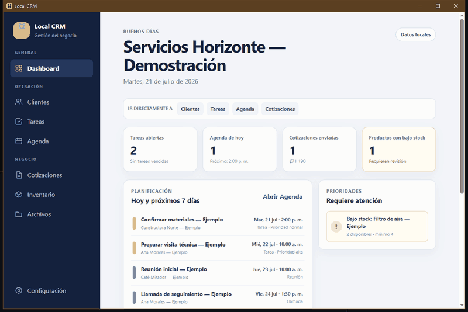
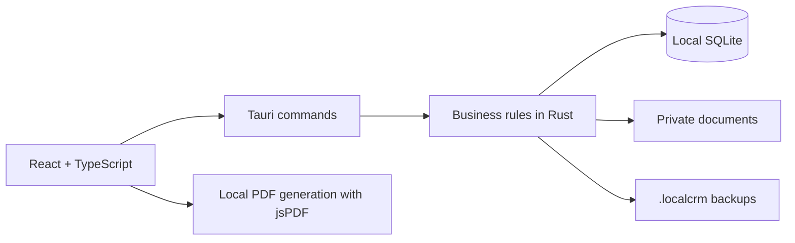

# Local CRM

[English](README.md) | [Español](README.es.md)

[](https://github.com/sbranma/local-crm/actions/workflows/ci.yml)

Local CRM is a Spanish-language Windows desktop application for small service businesses and independent professionals who need to manage their daily operations without relying on an external server. It works offline for its core features and keeps business information on the user's computer.

The product was designed with local Spanish-speaking businesses in mind, including small businesses in Costa Rica. Its interface, onboarding, and generated documents are currently available in Spanish.

**Status:** public version 0.1.0 for Windows x64.

[Download Local CRM v0.1.0 for Windows](https://github.com/sbranma/local-crm/releases/tag/v0.1.0)



*Real application walkthrough using fictional information generated by the built-in demo mode.*

## The business problem

Many small businesses need to organize customers, commitments, quotations, inventory, and documents, but do not require an enterprise platform or a monthly subscription. Local CRM brings that workflow together in a local application that is understandable, practical, and easy to back up.

The product is intended for technicians, contractors, freelancers, consultants, small agencies, and service providers working alone or with a small team.

## What this project demonstrates

- Translating business requirements into a complete product scope.
- Designing connected workflows across customers, tasks, schedules, quotations, inventory, and documents.
- Separating the interface, business rules, and persistence layers.
- Managing local data, schema migrations, validation, backups, and recovery.
- Delivering a Windows installer, versioned release, technical documentation, and automated quality checks.
- Making scope, privacy, security, and product limitations explicit.

## Main features

- Operational dashboard with upcoming work, priorities, quotation status, and recent customers.
- Customer CRUD with search, archiving, restoration, and confirmed permanent deletion.
- Tasks with priorities, statuses, schedules, and optional customer relationships.
- Monthly, weekly, and daily calendar views combining events and scheduled tasks without duplicating records.
- Quotations with line items, taxes, discounts, statuses, history, and offline PDF generation.
- Shared product and service catalog with auditable stock movements and low-stock controls.
- Private document management with folders and optional customer relationships.
- Business profile, currency, terms, and logo configuration for generated documents.
- Complete `.localcrm` backups with validation, preview, and safe restoration.
- First-run walkthrough and optional fictional data for exploring the complete workflow.

## Technology stack

- React and TypeScript for the component-based interface and explicit contracts.
- Vite for the frontend development and production build workflow.
- Tauri and Rust for the Windows desktop shell, native operations, validation, and business rules.
- SQLite for structured local persistence and versioned migrations.
- GitHub Actions for automated linting, type checks, builds, Rust tests, formatting, and Clippy.

## Architecture



The interface never queries SQLite directly. React presents information and validates user interactions; Tauri commands expose focused operations; Rust applies business rules, validates inputs, and accesses SQLite through parameterized queries.

## Selected technical decisions

- Monetary values are stored as integers to avoid floating-point errors.
- Inventory quantities support thousandths without storing decimal numbers in SQLite.
- Issued quotations preserve a snapshot of the customer data, descriptions, units, and prices used at that time.
- Tasks and calendar events remain separate data sources and are combined only for presentation.
- Inventory withdrawals cannot create negative stock.
- Documents use generated internal names with file type, size, signature, and path validation.
- Versioned migrations preserve compatibility with existing local databases when reasonable.
- Demo data can only be loaded into a completely empty database and is created inside a transaction.

## Local data and privacy

The installed application and business data are stored separately:

```text
Application: %LOCALAPPDATA%\Local CRM
SQLite:      %APPDATA%\com.localcrm.desktop\local-crm.sqlite3
Documents:   %APPDATA%\com.localcrm.desktop\documents
```

PDF files, exported copies, and backups are saved wherever the user chooses through native Windows dialogs. Before restoring a backup, Local CRM automatically creates `local-crm-before-last-restore.localcrm` next to the active database.

Local information and backups are **not encrypted**. The application is designed for one user on one Windows computer and does not currently include authentication, cloud synchronization, or multi-user permissions.

## Try the application

The Spanish NSIS installer is available in [GitHub Releases](https://github.com/sbranma/local-crm/releases/tag/v0.1.0). It installs for the current Windows user without requiring administrator access to the application folder.

On a new installation, users can:

1. Follow the four-step Spanish onboarding walkthrough.
2. Start with an empty database or load clearly identified fictional demo data.
3. Explore the Customer -> Task or Calendar -> Quotation -> PDF workflow.
4. Create a complete backup from **Configuración -> Respaldos**.

Windows may display a SmartScreen warning because this portfolio installer is not digitally signed.

## Local development

### Requirements

- Node.js LTS and npm.
- Stable Rust with the MSVC toolchain.
- Microsoft C++ Build Tools for desktop development.
- Microsoft Edge WebView2.

### Commands

```powershell
npm.cmd install
npm.cmd run tauri dev
```

Quality checks:

```powershell
npm.cmd run lint
npm.cmd run typecheck
npm.cmd run build
cargo fmt --manifest-path src-tauri/Cargo.toml --check
cargo test --manifest-path src-tauri/Cargo.toml
cargo clippy --manifest-path src-tauri/Cargo.toml --all-targets -- -D warnings
```

GitHub Actions runs these checks for every pull request and update to `main`.

## AI-assisted development

AI tools were used as support for exploring alternatives, accelerating iterations, and reviewing implementation and documentation. Product scope, architecture decisions, result validation, testing, and version control remained under the author's judgment and supervision.

## Scope and limitations

Local CRM is not intended to replace an ERP, tax-compliant invoicing system, or collaborative platform. Advanced reporting, email, WhatsApp, tax invoicing, authentication, encryption, external API integrations, and synchronization remain outside this version.

Product, architecture, security, and scope decisions are documented in [`PROJECT_CONTEXT.md`](PROJECT_CONTEXT.md), currently available in Spanish.

## Author and license

Portfolio project by **[Brian Moncaleano](https://www.linkedin.com/in/brian-moncaleano-8b7b89243/)** ([sbranma on GitHub](https://github.com/sbranma)), released under the [MIT License](LICENSE).

Official source code: [github.com/sbranma/local-crm](https://github.com/sbranma/local-crm)
